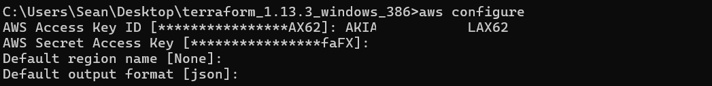
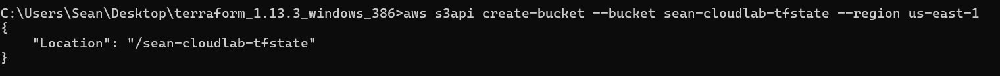
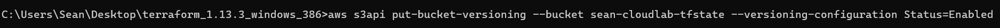
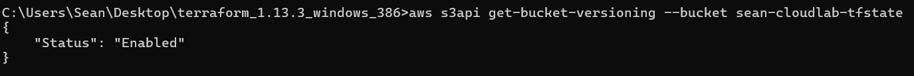
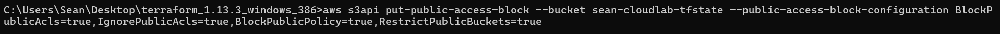
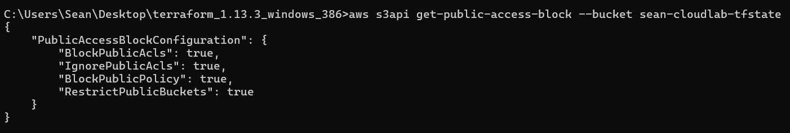

# Chapter 1 — Building the Foundation in AWS using Terraform

### Objective
In this chapter, we will set up the **foundation layer** of the AWS Cloud Lab. This is the first step in building a professional, cloud-native environment where we can practice **Infrastructure as Code (IaC), Kubernetes, CI/CD, and GitOps** workflows.

By the end of this chapter, we will have:

1. **A fully provisioned AWS network environment** (VPC, subnets, and Security Groups)
    
2. **A working EC2 instance** acting as the base server for your Kubernetes (K3s) cluster
    
3. **A Terraform setup with remote state storage** in S3 to manage our infrastructure safely and reproducibly
        

## **What We Will Learn**

- How to configure **AWS CLI** for programmatic access
    
- How to create **S3 buckets for Terraform remote state**
    
- How to provision basic AWS resources (VPC, subnets, EC2) using **Terraform**
    
- How to structure a **reproducible and documented workflow** for your cloud projects
    
- How to tag resources and set up a **cost-conscious environment** using free tier and budget alerts

This foundation will serve as the **base camp** for all future lab project expansions, including Kubernetes deployments, CI/CD pipelines, GitOps automation, and cloud-native monitoring.

### Step 1 - Setting Up AWS CLI & Terraform

### **Objective**
Prepare our local machine so we can securely and efficiently manage AWS resources using **Terraform**, with remote state stored in **S3**. This step ensures our infrastructure is **reproducible, version-controlled, and safe**.

---

### Install AWS CLI (if not already installed)

1. Open **PowerShell** as Administrator.
    
2. Run the command to verify if AWS CLI is already installed:
```
aws --version
```
3. If installed, you’ll see something like `aws-cli/2.x.x Python/3.x Windows/AMD64`.
- If not, download and install the latest version here: AWS CLI Windows Installer
- Once installed, configure it with your credentials:
```
aws configure
  ```
  - Enter your **AWS Access Key ID**
    
- Enter your **AWS Secret Access Key**
    
- Set the **Default region** (e.g. `us-east-1`)
    
- Set the **Default output format**: `json`



> This will create `~/.aws/credentials` and `~/.aws/config` files to store your settings securely.
> 
> Test the aws CLI access with a simple command:**
> ```
> aws iam list-users
> ```

### Step 2 - Install Terraform

1. Download the latest Windows Terraform binary: Terraform Downloads
2. Extract the `terraform.exe` to a folder, e.g., `C:\Tools\Terraform`
    
3. Add that folder to your **Windows PATH**:
    
    - Win + S → “Environment Variables” → Edit system environment variables → Environment Variables → Edit `Path` → Add `C:\Tools\Terraform`
        
4. Verify installation:
  ```
terraform -version
```

We should see something like `Terraform v1.5.x`

## OR
### We can just use the binary, from the folder its located in:
```
cd C:\Users\cloudlab-sean\Tools\terraform_1.13.3_windows_386

terraform -version
```

### Step 3 - Create S3 Bucket for Terraform Remote State

Remote state keeps track of what resources Terraform manages and allows **safe collaboration**. We’ll use S3 for this:

In **AWS CLI**:
Create a new Bucket `sean-cloudlab-tfstate`:
```
aws s3api create-bucket --bucket sean-cloudlab-tfstate --region us-east-1
```


Confirm that the new S3 Bucket is created:
```
aws s3 ls
```


### Step 4 - Enable Versioning on the newly created bucket:
```
aws s3api put-bucket-versioning --bucket sean-cloudlab-tfstate --versioning-configuration Status=Enabled
```


Check to ensure Versioning is Enabled:
```
aws s3api get-bucket-versioning --bucket sean-cloudlab-tfstate
```



### Step 5 - Set configuration to **disallow Public Access** to the bucket:
```
aws s3api put-public-access-block --bucket sean-cloudlab-tfstate --public-access-block-configuration BlockPublicAcls=true,IgnorePublicAcls=true,BlockPublicPolicy=true,RestrictPublicBuckets=true
```


Check to ensure Public Access is blocked, with all `true` values in the output:
```
aws s3api get-public-access-block --bucket sean-cloudlab-tfstate
```

    
### Step 6 - Make a note of the **bucket name** as we will reference it in Terraform.
