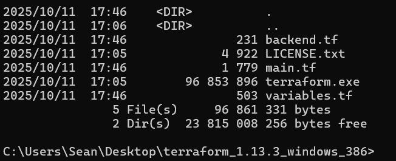

# Chatper 2 — Terraform for VPC + EC2 deployment with Remote State Setup

### Objective
Setup basic AWS Infrastructure (VPC, EC2) using Terrafrom with Remote State.

### Step 1 - Prepare Our Terraform Folder

Navigate to the terraform directory where the binary is located:
```
cd C:\Users\cloudlab-sean\Tools\terraform_1.13.3_windows_386
```

Inside this folder, we’ll create three main files:

- `main.tf` → Our resource definitions (VPC, subnets, EC2)
    
- `variables.tf` → Input variables (regions, instance types, etc.)
    
- `backend.tf` → S3 remote state configuration



### Step 2 - Configure Terraform Backend (S3 Remote State)

First, we create a file named `backend.tf`:
```
terraform {
  required_version = ">= 1.5.0"

  backend "s3" {
    bucket         = "sean-cloudlab-tfstate"
    key            = "terraform/terraform.tfstate"
    region         = "us-east-1"
    encrypt        = true
  }
}
```
- This tells Terraform to **store its state in our S3 bucket**, encrypted.
    
- The `key` is the path inside the bucket and we can change later for multiple environments (dev, prod, etc.).

### Step 3 - Define Input Variables

Next, we create a file `variables.tf`:
```
variable "region" {
  description = "AWS region"
  type        = string
  default     = "us-east-1"
}

variable "vpc_cidr" {
  description = "CIDR block for VPC"
  type        = string
  default     = "10.0.0.0/16"
}

variable "public_subnet_cidr" {
  description = "CIDR block for public subnet"
  type        = string
  default     = "10.0.1.0/24"
}

variable "instance_type" {
  description = "EC2 instance type"
  type        = string
  default     = "t3.micro"   # free tier
}
```

### Step 4 - Define Resources (VPC + EC2)

Create a file `main.tf`:
```
provider "aws" {
  region = var.region
}

# VPC
resource "aws_vpc" "cloudlab_vpc" {
  cidr_block = var.vpc_cidr
  tags = {
    Name = "cloudlab-vpc"
  }
}

# Public Subnet
resource "aws_subnet" "public_subnet" {
  vpc_id                  = aws_vpc.cloudlab_vpc.id
  cidr_block              = var.public_subnet_cidr
  map_public_ip_on_launch = true
  tags = {
    Name = "cloudlab-public-subnet"
  }
}

# Internet Gateway
resource "aws_internet_gateway" "igw" {
  vpc_id = aws_vpc.cloudlab_vpc.id
  tags = {
    Name = "cloudlab-igw"
  }
}

# Route Table
resource "aws_route_table" "public_rt" {
  vpc_id = aws_vpc.cloudlab_vpc.id
  route {
    cidr_block = "0.0.0.0/0"
    gateway_id = aws_internet_gateway.igw.id
  }
  tags = {
    Name = "cloudlab-public-rt"
  }
}

# Route Table Association
resource "aws_route_table_association" "public_assoc" {
  subnet_id      = aws_subnet.public_subnet.id
  route_table_id = aws_route_table.public_rt.id
}

# Security Group for SSH
resource "aws_security_group" "ssh_sg" {
  name        = "cloudlab-ssh-sg"
  description = "Allow SSH"
  vpc_id      = aws_vpc.cloudlab_vpc.id

  ingress {
    from_port   = 22
    to_port     = 22
    protocol    = "tcp"
    cidr_blocks = ["0.0.0.0/0"]
  }

  egress {
    from_port   = 0
    to_port     = 0
    protocol    = "-1"
    cidr_blocks = ["0.0.0.0/0"]
  }

  tags = {
    Name = "cloudlab-ssh-sg"
  }
}

# EC2 Instance
resource "aws_instance" "cloudlab_ec2" {
  ami                     = "ami-0ec4ab14b1c5a10f2" # Ubuntu 20.04 LTS in us-east-1
  instance_type           = "t3.small"
  subnet_id               = aws_subnet.public_subnet.id
  vpc_security_group_ids  = [aws_security_group.ssh_sg.id]
  key_name                = aws_key_pair.cloudlab_key.key_name
  tags = {
    Name = "cloudlab-ec2"
  }
}
```

### Step 5 - Initialize Terraform

From CMD/ PowerShell, in the `terraform` folder:
```
terraform init
```


- Terraform will read `backend.tf` and connect to **our S3 bucket for remote state**.
    
- Check for `Successfully configured the backend "s3"!`

### Step 6 - Plan and Apply

**Check Plan**

```
terraform plan
```


**Apply Infrastructure**
```
terraform apply
```
**Terraform will ask for confirmation → type `yes`**


    
- After a few minutes, we should have **VPC, subnet, internet gateway, route table, security group, and an EC2 instance** up and running.
