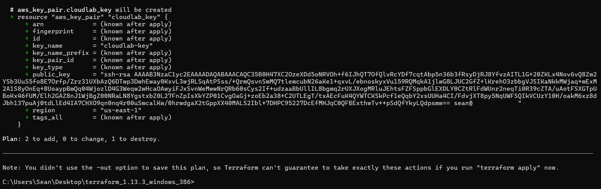

# Chapter 3 — EC2 with K3s Installation

### Connecting to EC2 for Kubernetes setup and config

The next step is **connecting to `cloudlab-ec2` via SSH** so we can start installing **K3s** and get our Kubernetes lab rolling.

Get the Public IP of the EC2:
```
aws ec2 describe-instances --instance-ids i-05d464fba9d2f98c1 --query "Reservations[].Instances[].PublicIpAddress" --region us-east-1 --output table
```


**The instance ID must be obtained from the previous step when Terraform created the EC2 Instance, it prints the Instance ID to terminal output.**

We realize that we never created a new Key Pair in order to SSH to the newly created EC2 Instance, but that is not an issue, we can just add it afterwards:

# Navigate to a folder where you want to store the key on your host machine
```
cd C:\Users\cloudlab-sean\Tools\terraform
```

### Step 1 - Generate a new SSH key (RSA 4096)
```
ssh-keygen -t rsa -b 4096 -f cloudlab-key
```


### **Step 2 - Reference the public key in Terraform**

Update `main.tf`

```
# Upload local public key to AWS as a key pair
resource "aws_key_pair" "cloudlab_key" {
  key_name   = "cloudlab-key"
  public_key = file("C:/Users/cloudlab-sean/Tools/terraform/cloudlab-key.pub")
}

# EC2 instance
resource "aws_instance" "cloudlab_ec2" {
  ami                    = "ami-08962a4068733a2b6"
  instance_type           = "t3.small"
  subnet_id               = aws_subnet.public_subnet.id
  vpc_security_group_ids  = [aws_security_group.ssh_sg.id]
  key_name                = aws_key_pair.cloudlab_key.key_name
  tags = {
    Name = "cloudlab-ec2"
  }
}
```

### Step 3 - Run Terraform 'plan' command, with our updated `main.tf` file:

```
terraform plan
```


Run Terraform 'apply' command, with our updated `main.tf` file (We use -auto-approve to skip the prompt to enter "Yes"):
```
terraform apply -auto-approve
```

**Due to the Key Pair being created, the existing EC2 Instance must be destroyed, and a new EC2 Instance must be created, in order to associate the Key Pair.**


Get the Public IP of the **Newly** created EC2 Instance:
```
aws ec2 describe-instances --instance-ids i-05d464fba9d2f98c1 --query "Reservations[].Instances[].PublicIpAddress" --region us-east-1 --output table
```


**The instance ID must be obtained from the previous step when Terraform created the EC2 Instance, it prints the Instance ID to terminal output.**

Now that we have our Key Pair created and associated it with our EC2 Instance, we can SSH into the machine, using its Public IP:
```
ssh -i "C:\Users\cloudlab-sean\Tools\terraform\cloudlab-key" ubuntu@<EC2_PUBLIC_IP>
```


### Step 5 - Let’s get **K3s** installed so we have a lightweight Kubernetes cluster to work with

### Update the Instance

Always good practice to start with an updated system:
```
sudo apt-get update -y
sudo apt-get upgrade -y
```


### Install K3s:
```
curl -sfL https://get.k3s.io | sh -
```


**Wait a few minutes until the K3s services are started and configured, before running below commands**:

### Verify K3s is running:
```
sudo kubectl get nodes
sudo kubectl get pods -A
```
- Should show our **single node ready**.


- All system pods (in `kube-system`) should be running.

### Use kubectl without sudo (Optional)

```
mkdir -p ~/.kube
sudo cp /etc/rancher/k3s/k3s.yaml ~/.kube/config
sudo chown $(id -u):$(id -g) ~/.kube/config
export KUBECONFIG=~/.kube/config
```
- Makes `kubectl` commands usable **without sudo**.
    
- For persistent sessions, add `export KUBECONFIG=~/.kube/config` to `~/.bashrc`.
