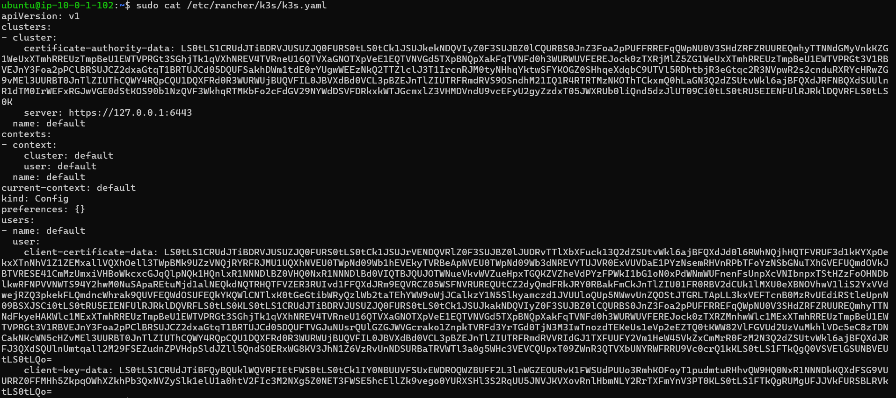
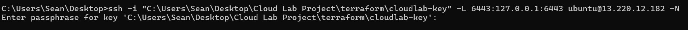
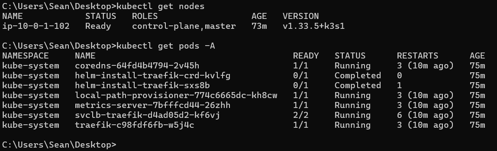
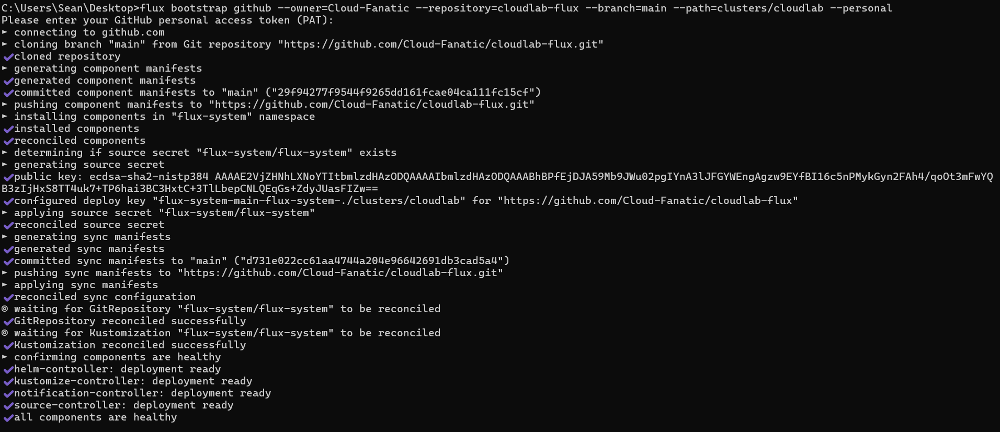
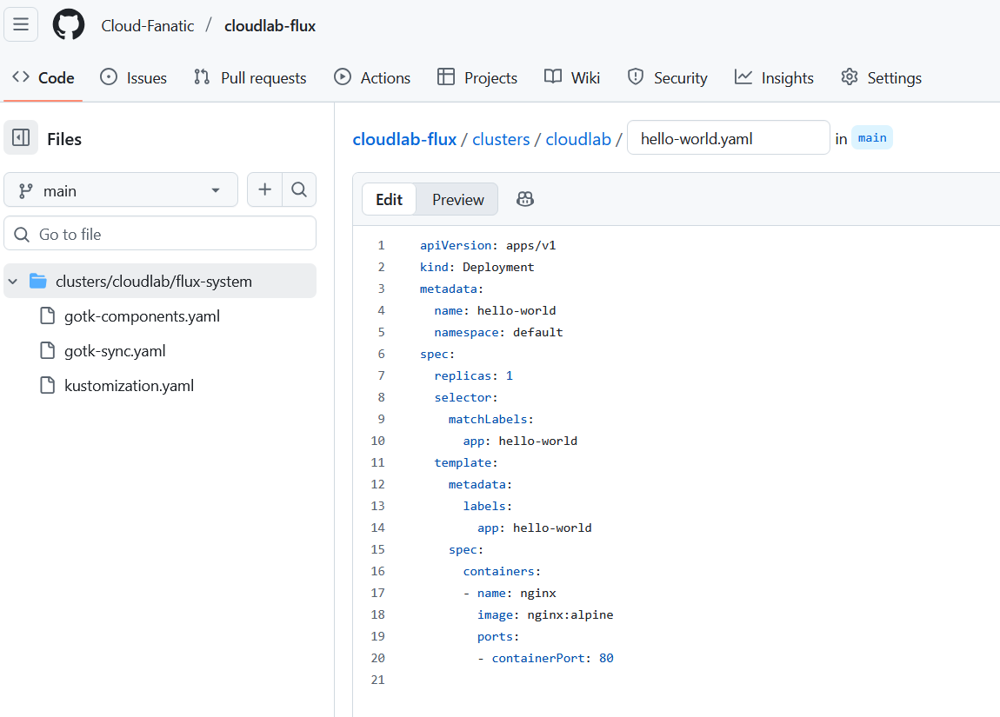
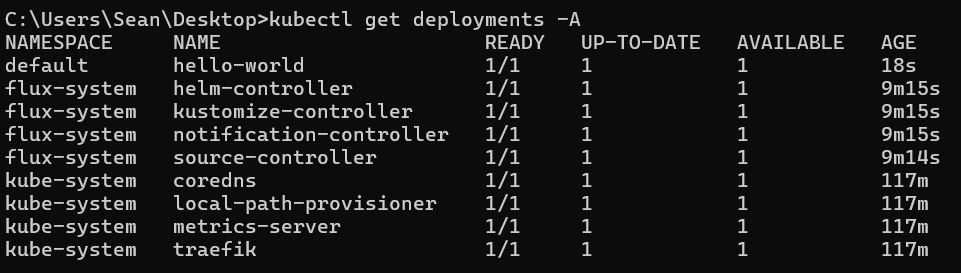

## **Chapter 4 – Infrastructure as Code + GitOps Integration**

### Objective
We’re going to connect our **Kubernetes cluster** to **GitHub (GitOps workflow)** using **FluxCD**, so that any configuration changes pushed to GitHub automatically sync and deploy to our cluster.

This step demonstrates:

- **Continuous Deployment (CD)** in practice
    
- **Infrastructure as Code** principles
    
- **Production-style automation** used by real DevOps teams
    

### What We’ll Do

1. **Install Flux CLI** on our host machine (Windows 11).
    
2. **Bootstrap Flux** into our running K3s cluster.
    
3. **Connect Flux to a GitHub repository** that will store our Kubernetes manifests.
    
4. Verify that our cluster syncs automatically from GitHub.

First we will start by installing FluxCD on our host machine (Windows 11):
https://github.com/fluxcd/flux2/releases


### **Step 1 - Connect `kubectl` to the cluster**

On your **Windows host machine**, we’ll need our **kubeconfig** from the K3s server (the EC2 instance).

On the **EC2 (K3s) instance**, run:
```
sudo cat /etc/rancher/k3s/k3s.yaml
```
**Copy the entire output:**



Then on our **Windows** machine, we create this file:
`C:\Users\<your-username>\.kube\config`

Next, we need to setup a **Local Port Forward** to allow our Windows 11 machine access to the K3s instance running locally on the Ubuntu EC2 machine on localhost:6443:
```
ssh -i "C:\Users\cloudlab-sean\Tools\terraform\cloudlab-key" -L 6443:127.0.0.1:6443 ubuntu@<EC2-PublicIP> -N
```


Now we should be able to use **kubectl** on our Windows 11 machine, to view the cluster info via the SSH Local Port Forward tunnel we've setup:
```
kubectl get nodes
kubectl get pods -A
```



Now that we have **K3s running** and our **SSH tunnel making the cluster accessible**, we can move to the **GitOps / Flux part** of our lab. This is where our infrastructure becomes **declarative and automatically managed**.

## **Step 2 - Prepare the Flux CLI Command**

On our **Windows host machine**, with the SSH tunnel open to EC2:

```
flux bootstrap github --owner=Cloud-Fanatic --repository=cloudlab-flux --branch=main --path=clusters/cloudlab --personal
```
**Enter the Github PAT token when prompted**



**NOTE: If you don't have a PAT Token setup in Github. GitHub account --> Settings --> Developer Settings --> Personal Access Tokens (classic)**

## **GitOps Flow is Working!**

Any YAML manifest we commit to the `cloudlab-flux` repo (under `clusters/cloudlab/`) will automatically be applied to our K3s cluster. Neat!
    
We now have the ability to manage deployments, namespaces, services, ConfigMaps, and more all from Git!

## **Step 3 - Test it with a Sample App**

Let’s make sure everything is working:

1. In our `cloudlab-flux` repo, we create a new file `clusters/cloudlab/hello-world.yaml`:
```
apiVersion: apps/v1
kind: Deployment
metadata:
  name: hello-world
  namespace: default
spec:
  replicas: 1
  selector:
    matchLabels:
      app: hello-world
  template:
    metadata:
      labels:
        app: hello-world
    spec:
      containers:
      - name: nginx
        image: nginx:alpine
        ports:
        - containerPort: 80
   ```



2. Commit and push to `main`.
    
3. Watch Flux automatically deploy:
```
kubectl get pods -A
kubectl get deployments -A
```


We should see the `hello-world` pod running!

