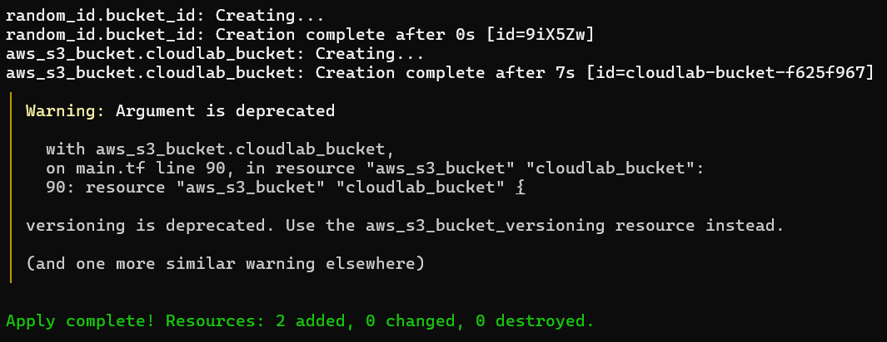

# Chapter 5 — Provision further AWS Services to Integrate with Apps in the Kubernetes cluster

### Objective
Let’s take our lab to the next level by **provisioning an AWS resource with Terraform** and then connecting it to a Kubernetes app.

We’ll start **simple but meaningful**: an **S3 bucket** that a K8s app can use. Later on, we can extend to RDS, Secrets, or other services.

In our Terraform `main.tf` file, we add an S3 bucket resource:
```
resource "aws_s3_bucket" "cloudlab_bucket" {
  bucket = "cloudlab-bucket-${random_id.bucket_id.hex}"
  acl    = "private"

  versioning {
    enabled = true
  }

  tags = {
    Name        = "cloudlab-bucket"
    Environment = "Lab"
  }
}

resource "random_id" "bucket_id" {
  byte_length = 4
}
```

- We use `random_id` to make the bucket name unique (S3 bucket names must be globally unique).
    
- Versioning is enabled — good practice for backups.
    
- Keep `acl = "private"` to avoid public exposure.

### Apply Terraform

```
terraform init
terraform plan
terraform apply
```


- Terraform will create the S3 bucket in your AWS account.
    
- Copy the **bucket name** — we’ll use it in Kubernetes.
