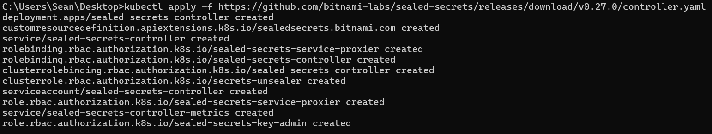
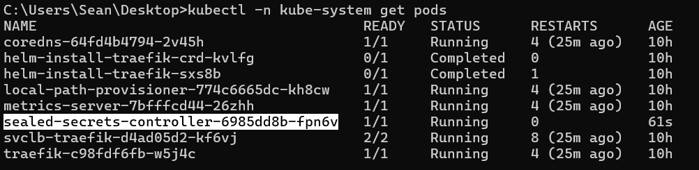
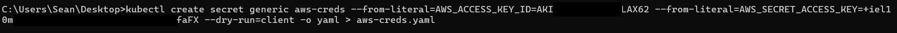
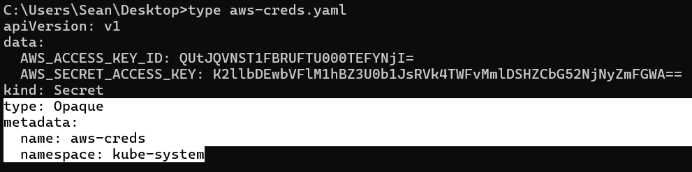
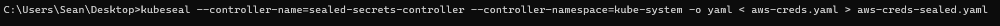
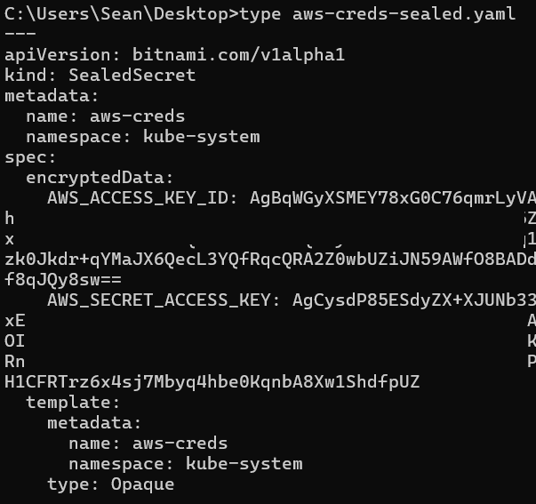
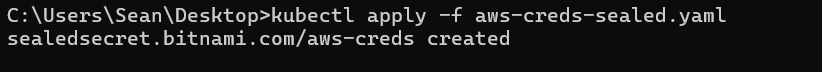
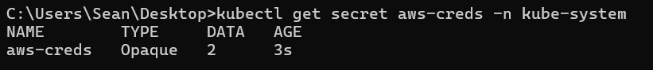

# Chapter 6 — Setup K3s Sealed Secrets

### Objective
Prepare Kubernetes App to Use S3 & Using K3s **Sealed Secrets**

- In our `cloudlab-flux` repo, we will create a new Deployment for an app (example: a simple Python app that uploads to S3).
    

### How K3s Sealed Secret Works

- We first install the **Sealed Secrets controller** on our Kubernetes cluster.
    
- It generates a **private key** that never leaves the cluster.
    
- We use the **`kubeseal`** CLI tool with its **public key** to encrypt our Secret.

That produces a **SealedSecret YAML file**, which we can safely commit to GitHub:
```
apiVersion: bitnami.com/v1alpha1
kind: SealedSecret
metadata:
  name: aws-creds
  namespace: default
spec:
  encryptedData:
    AWS_ACCESS_KEY_ID: AgBsZXp0M3Zk... (gibberish)
    AWS_SECRET_ACCESS_KEY: AgBjdTNyY... (more gibberish)
```
The contents look like random strings, however nobody can decode them **except** the Sealed Secrets controller inside _your_ cluster, because it holds the **matching private key**.

### Benefits of Using K3s Sealed Secrets

- Ensure it is safe to commit and sync with Flux.
    
- Safe even if our GitHub repo or Flux logs are leaked.
    
- We can freely share our repo for collaboration without exposing secrets.

### What We Shouldn’t Do with Sealed Secrets

- Never commit the **original Secret YAML**, only the **SealedSecret**.
    
- Never export the controller’s **private key** (unless you’re doing disaster recovery).

## Step 1 - Install the Sealed Secrets controller on K3s

On the machine where we have `kubectl` access to our cluster, run:
```
kubectl apply -f https://github.com/bitnami-labs/sealed-secrets/releases/latest/download/controller.yaml
```
This deploys the controller into the `kube-system` namespace.



We can confirm it’s up with:
```
kubectl -n kube-system get pods
```


## Step 2 - Install the `kubeseal` CLI

**Windows:**  

Download from:  
🔗 [https://github.com/bitnami-labs/sealed-secrets/releases](https://github.com/bitnami-labs/sealed-secrets/releases)

**Linux:**
```
sudo wget https://github.com/bitnami-labs/sealed-secrets/releases/download/v0.27.0/kubeseal-linux-amd64 -O /usr/local/bin/kubeseal
sudo chmod +x /usr/local/bin/kubeseal
```

## Step 3 - Create a regular Kubernetes Secret

Let’s start simple. Create a test secret named `aws-creds` (don’t worry, we’ll seal it next):
```
kubectl create secret generic aws-creds --from-literal=AWS_ACCESS_KEY_ID=your_access_key --from-literal=AWS_SECRET_ACCESS_KEY=your_secret_key --dry-run=client -o yaml > aws-creds.yaml
```


## Step 4 - Configure/ edit the `aws-creds.yaml` file
It is important to that we add specific information to the `aws-creds.yaml` file that was just created in the previous step. 
We add the `type: Opaque` and the `namespace: kube-system` parameters:

```
apiVersion: v1
data:
  AWS_ACCESS_KEY_ID: QUtJQ<REDACTED>NjI=
  AWS_SECRET_ACCESS_KEY: K2llbDEwbVFlM1<REDACTED>mFGWA==
kind: Secret
type: Opaque
metadata:
  name: aws-creds
  namespace: kube-system
```

## Step 5 - Seal it

Now run:
```
kubeseal --controller-name=sealed-secrets-controller --controller-namespace=kube-system -o yaml < aws-creds.yaml > aws-creds-sealed.yaml
```




## Step 6 - Apply the Sealed Secret to our K3s Cluster

Run the below, to apply the sealed secret to our K3s cluster:
```
kubectl apply -f aws-creds-sealed.yaml
```


## Step 7 - Verify the Sealed Secret was created

```
kubectl get secret aws-creds -n kube-system
```

The `aws-creds` Secret now exists in the `kube-system` namespace.


Now we can safely use the Secret in our cluster without exposing your AWS credentials anywhere, even in GitHub! 
