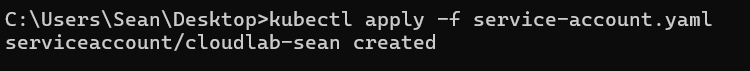
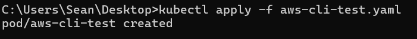
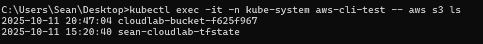

# Chapter 7 — Using our new Sealed Secret with Terraform or other pods/services

### Objective 
Using our new Secret with Terraform or other pods/services** in our cluster so our workloads can authenticate to AWS securely

#### Create a ServiceAccount that uses the Secret

We need to make a dedicated **ServiceAccount** in K3s, that references the Secret as environment variables:
```
apiVersion: v1
kind: ServiceAccount
metadata:
  name: cloudlab-sean
  namespace: kube-system   # <-- changed from default
secrets:
  - name: aws-creds
```

**Apply** the `service-account.yaml` manifest:
```
kubectl apply -f service-account.yaml
```


Next, we use our newly created **Service Account** in the below new manifest `aws-cli-test.yaml`, which uses the amazon/aws-cli **image** to allow us to run AWS CLI commands:
```
apiVersion: v1
kind: Pod
metadata:
  name: aws-cli-test
  namespace: kube-system
spec:
  serviceAccountName: cloudlab-sean
  containers:
    - name: aws
      image: amazon/aws-cli:2.14.0
      command: ["sleep", "3600"]   # keep pod alive
      envFrom:
        - secretRef:
            name: aws-creds
```

**Apply** the `aws-cli-test.yaml` manifest:
```
kubectl apply -f aws-cli-test.yaml
```


Finally, we can test our **aws-cli-test pod**, by running an AWS S3 list all buckets command:
```
kubectl exec -it -n kube-system aws-cli-test -- aws s3 ls
```

