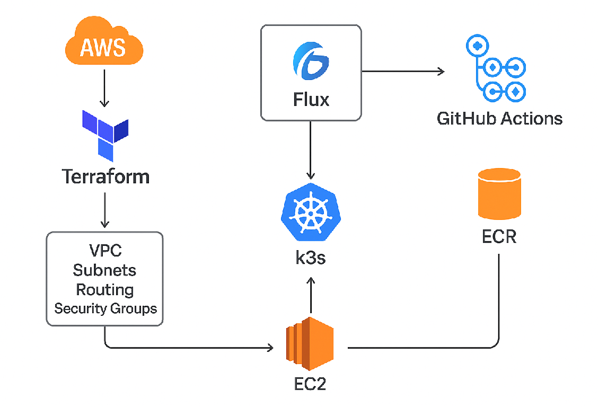

# CloudLab - AWS, Terraform, Kubernetes & GitOps&nbsp;

## ☁️ About This Project 𖣘&nbsp;
Hi, I'm Sean G!
This repository documents my personal cloud lab, built to explore and demonstrate modern Cloud Engineering and DevOps practices using real-world production technologies.

It showcases an end-to-end, GitOps-driven CI/CD environment with automated infrastructure provisioning, secure secret management, and continuous delivery pipelines.&nbsp;

### Tech Stack Overview&nbsp;

➡️ Infrastructure as Code (IaC) — Provisioned with Terraform on AWS (VPC, subnets, security groups, EC2, ECR)

➡️ Kubernetes (k3s) — Lightweight production-grade cluster hosted on AWS EC2

➡️ GitOps Continuous Delivery — Managed with FluxCD, syncing cluster state directly from Git

➡️ Continuous Integration (CI) — Implemented via GitHub Actions for automated builds, testing, image scanning, and deployments to Amazon ECR

➡️ Secrets Management — Securely handled through Sealed Secrets and optional External Secrets Operator

➡️ Observability Stack — Includes Prometheus, Grafana, and Loki for metrics, dashboards, and log aggregation

➡️ Security & Policy Enforcement — Enhanced with Kyverno and Trivy for compliance and vulnerability scanning 

&nbsp;

### Table of Contents&nbsp;
1. [Chapter 1 - Building the Foundation: AWS + Terraform](Chapter1-Building-the-Foundation-AWS-Terraform.md)
2. [Chapter 2 - Terraform Deploy: VPC & EC2](Chapter2-Terraform-Deploy-VPC-EC2.md)
3. [Chapter 3 - EC2 & k3s Setup](Chapter3-EC2-K3s-Setup.md)
4. [Chapter 4 - IaC, Flux & GitOps Setup](Chapter4-IaC-Flux-GitOps-Setup.md)
5. [Chapter 5 - Deploying Additional Apps on k3s with Terraform](Chapter5-Terraform-Additional-App-on-K3s.md)
6. [Chapter 6 - k3s Sealed Secrets Setup](Chapter6-K3s-Sealed-Secrets-Setup.md)
7. [Chapter 7 - Applying Sealed Secrets in Pods & Services](Chapter7-Apply-Sealed-Secrets-in-Pods-Services.md)
8. **[PLANNED]** Chapter 8 - CI/CD Pipeline deployment, config and integration&nbsp;
